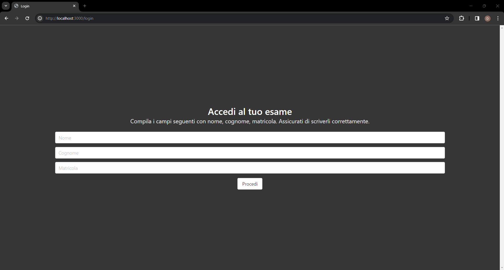
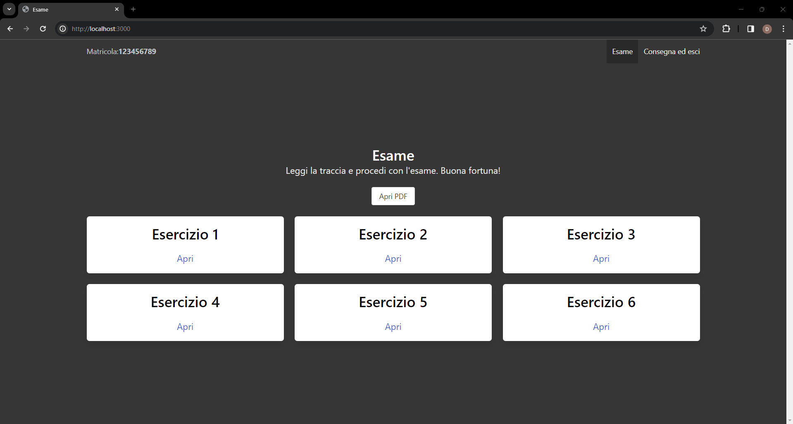
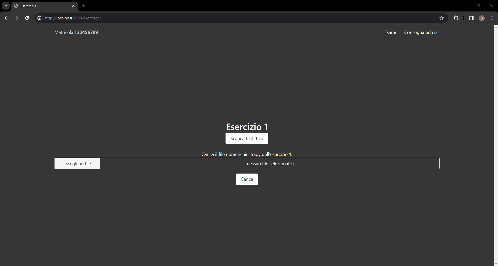
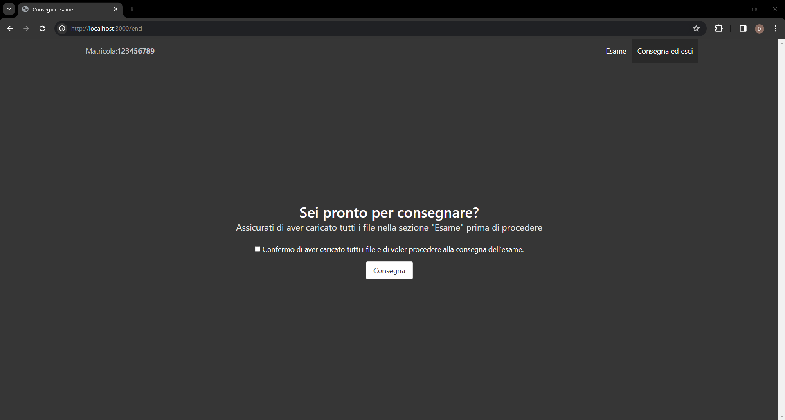

# Informatica Stat

## Configurazione
Nelle impostazioni della macchina virtuale su VirtualBox, nella sezione "Rete", impostare la scheda "Adattatore 1" come "NAT" e aprire la porta 3000.

## Instalalzione
Installare le dipendenze con il comando `pip install -r requirements.txt`.

## Avvio
Avviare il server con il comando `python3 main.py`.

## Come utilizzare
Nella cartella `static/files` devono essere inseriti i file:
- `exam.pdf` contenente il testo dell'esame
- `test_{n}.py` contenente il codice di test dell'esercizio n

## Come funziona
Il server salva i file caricati nella cartella `uploads` all'interno di sotto cartelle con l'indirizzo IP del client che ha caricato il file.
E.g. `uploads/192.168.50.1/` contiene i file caricati dal client con indirizzo IP `es1.py`, `es2.py`, ecc. e un file `info.txt` contenente informazioni sul nome, cognome, matricola, ip, data e ora di inizio e consegna dell'esame.

## Screenshots

